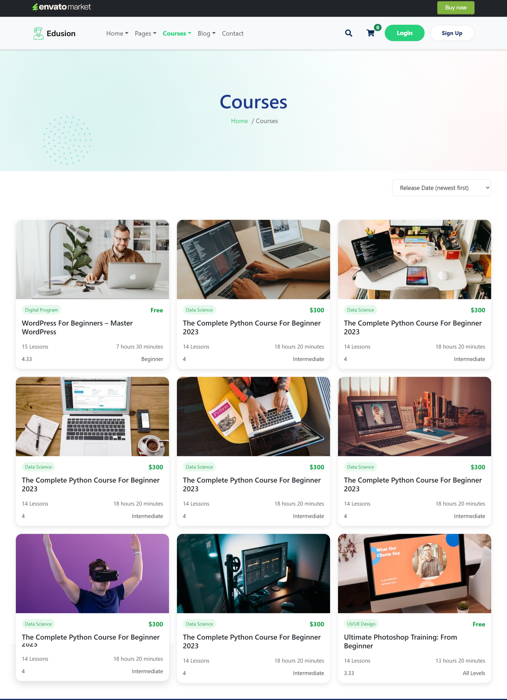

# ⚡ Learning Management System (LMS)

A responsive and modern web application built using **React**, **HTML**, **CSS**, and **JavaScript** to provide an interactive platform for online learning, course management, and student engagement.

---

## 📚 Features

- **Course Management:**  
  Browse and view different courses with details, categories, and dates.

- **User-Friendly Interface:**  
  Easy navigation between Home, Courses, About, and Contact sections.

- **Responsive Design:**  
  Works seamlessly on both desktop and mobile devices.

- **Interactive Sections:**  
  Includes banners, blog previews, and scrolling logos for a modern look.

---

## 🖼️ Screenshots

### Home Page

### Courses Section

### About Page

---

## 🛠️ Technologies Used

- **React.js** – Frontend library for building UI components  
- **HTML5** – Page structure  
- **CSS3** – Styling with Flexbox and Grid for responsive layouts  
- **JavaScript** – Dynamic interactivity  

---

## 🌐 Live Demo

You can see the project live here:  
https://osama-cs-dev.github.io/LMS/
